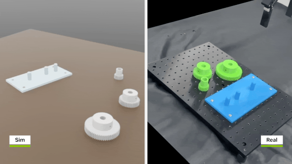

# Overview

This launchable includes the GTC26 course materials for **Train and Deploy Contact-Rich Robot Manipulation Skills**. The lab walks you through training a reinforcement learning policy for a **UR10e** with a **Robotiq 2F140** gripper to insert gears in simulation, then validating that policy in Isaac Lab. Deployment on a real robot is discussed but not demonstrated here.

Course documents in this workspace live at **`/workspace/contact_rich_manipulation/docs/`** (or `contact_rich_manipulation/docs/` relative to the VS Code workspace). Read them in order:

1. **`01-setup.md`** — environment, web viewer, terminal, command quick reference  
2. **`02-train.md`** — RL background, environment configuration, training (including full-scale headless runs)  
3. **`03-validate.md`** — TensorBoard and `play.py` validation  
4. **`04-deploy.md`** — pointers to Isaac ROS deployment docs  
5. **`05-conclusion.md`** — recap and next steps  

## Learning Objectives

By the end of this module, you’ll be able to:

- **Train a gear insertion RL policy in Isaac Lab.**

- **Validate an RL policy in Isaac Lab.**

- **Check out a trained gear insertion policy via Isaac ROS.**
