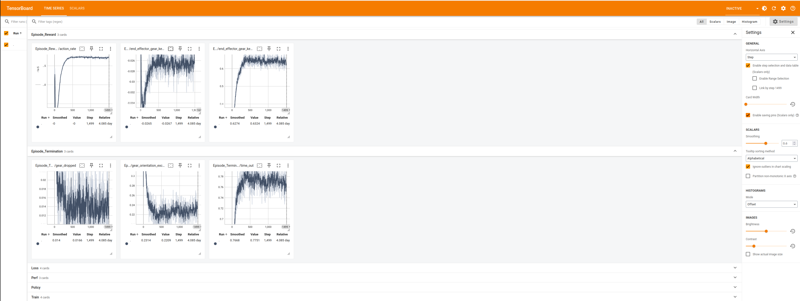
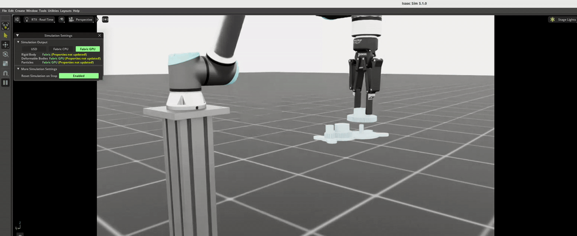

# Validating an RL Policy in Isaac Lab

In this lesson, we will validate a reinforcement learning (RL) policy that has been trained using IsaacLab.

## Visualize Training Metrics with TensorBoard

You can monitor training progress in real-time using TensorBoard.

In a terminal, run:

```bash
${ISAACLAB}/isaaclab.sh -p -m tensorboard.main --logdir /workspace/logs/rsl_rl/gear_assembly_ur10e --bind_all
```

Use the **`--logdir`** path that contains your run’s event files. For the gear-assembly UR10e tasks, logs usually live under **`/workspace/logs/rsl_rl/gear_assembly_ur10e/`**; training also prints **`[INFO] Logging experiment in directory:`** with the exact folder. **`--bind_all`** is included so TensorBoard listens on all interfaces (on **NVIDIA Brev**, forward port **6006** to the instance, then open the URL your environment provides—`http://localhost:6006` on your laptop only works if that port is forwarded).

Navigate to the following address in a web browser to visualize the training metrics:

http://localhost:6006



## Validate Policy Performance in Isaac Lab

The policy performance can be validated by deploying it in Isaac Lab by running following command.

Set **`CHECKPOINT_PT`** to the full path of your trained weights (RSL-RL saves **`model_<iteration>.pt`** inside a timestamped subdirectory under **`/workspace/logs/rsl_rl/gear_assembly_ur10e/`**—use **`ls`** or the training log line to locate the file).

```bash
${ISAACLAB}/isaaclab.sh -p ${ISAACLAB}/scripts/reinforcement_learning/rsl_rl/play.py \
    --task Isaac-Deploy-GearAssembly-UR10e-2F140-ROS-Inference-v0 \
    --num_envs 4 \
    --checkpoint "${CHECKPOINT_PT}" \
    --livestream 2
```

**`--livestream 2`** streams the viewport on this launchable (omit only if you use a local desktop window).

A successfully trained policy should be able to insert all 3 gears with the gear base in different locations.



You can stop the simulation by pressing `Ctrl+C` in the terminal.
